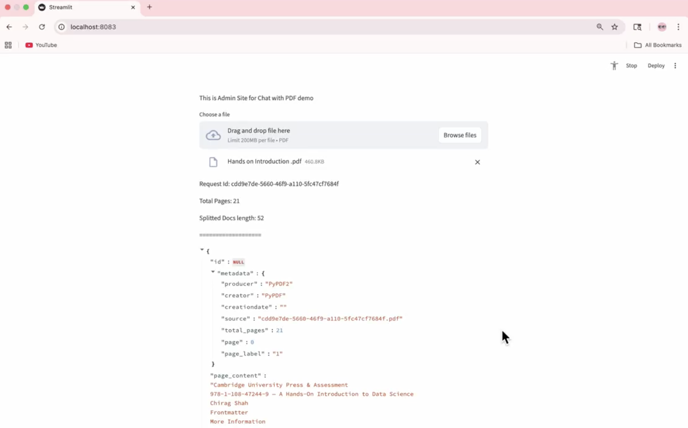
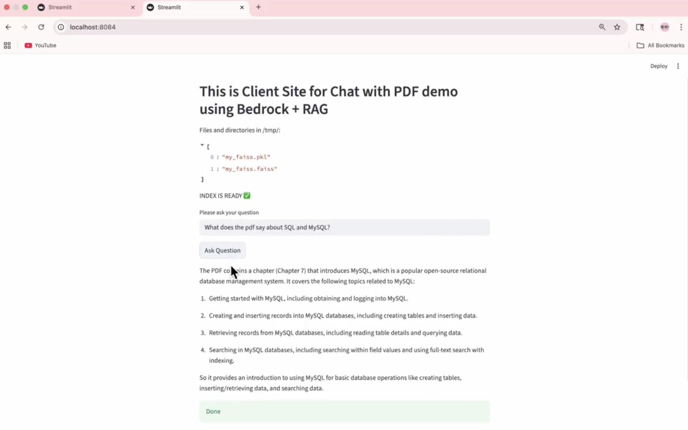
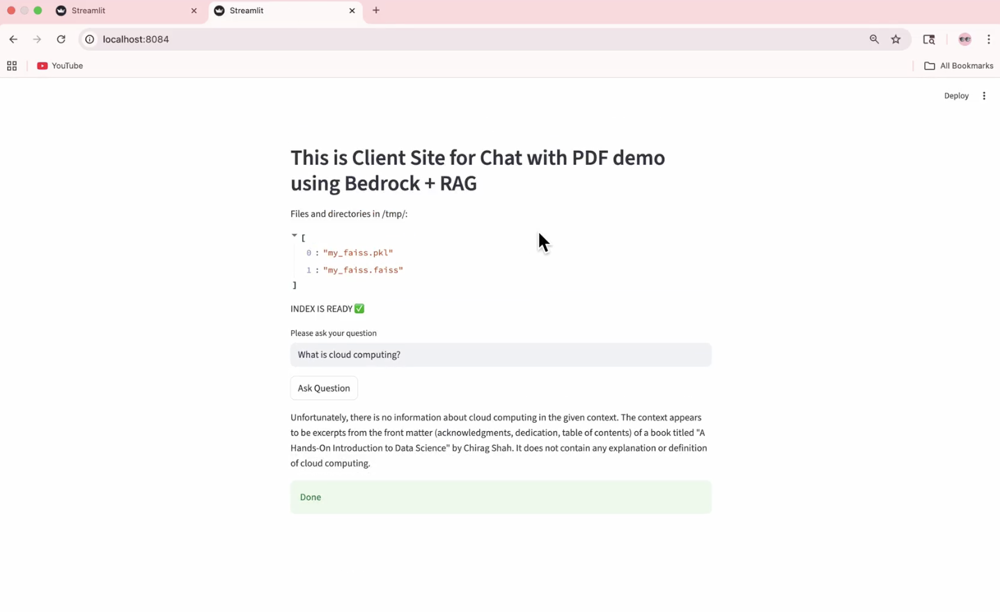

# 📄 CHAT-WITH-PDF-GENERATIVE-AI-APPLICATION-USING-AWS-BEDROCK-LANGCHAIN-PYTHON-FAISS-DOCKER-S3

## 📌 Overview
This project is a **secure “Chat with PDF” application** built using a **Retrieval-Augmented Generation (RAG)** architecture.

It follows a **real-world enterprise design** by separating access into two interfaces:
- **Admin App** → Used by authorized personnel to upload and manage official PDF documents and build the vector index.
- **User App** → Allows users to ask questions and receive answers strictly based on approved documents.

This design prevents unauthorized uploads, ensures consistent knowledge sources, and is especially useful in **compliance, HR, and legal** environments.

## 🧠 System Architecture (RAG Flow)
1. Admin uploads PDF documents  
2. PDFs are split into semantic chunks  
3. Chunks are converted into embeddings using **Amazon Titan Embeddings (AWS Bedrock)**  
4. Embeddings are stored in a **FAISS vector index**  
5. User submits a query  
6. Relevant chunks are retrieved from FAISS  
7. An LLM generates grounded responses using retrieved context  

This ensures responses are **fact-based and document-grounded**, minimizing hallucinations.

## ⚙️ Key Features

### 🔐 Role-Based Access Control
- Admin-only PDF uploads and index creation
- Users can only query approved documents
- Centralized and controlled knowledge base

### 📦 AWS Integration
- **AWS Bedrock** for embeddings and language model inference
- **Amazon S3** for secure document storage

### ⚡ Efficient Retrieval
- **FAISS** enables fast similarity search over large document collections

### 🐳 Containerized Deployment
- Separate Docker containers for Admin and User apps
- Ensures environment consistency across systems

## 🧰 Technology Stack
- Python  
- Streamlit  
- LangChain  
- FAISS  
- AWS Bedrock (Titan Embeddings + LLM)  
- Amazon S3  
- Docker 

## Project Screenshots
<div align="center">
  
  
  
</div>

## 🔑 Environment Configuration
Environment variables are required for AWS access and S3 integration.

Example:
```bash
BUCKET_NAME=your-s3-bucket-name
AWS_ACCESS_KEY_ID=your-access-key
AWS_SECRET_ACCESS_KEY=your-secret-key
AWS_DEFAULT_REGION=us-east-1
